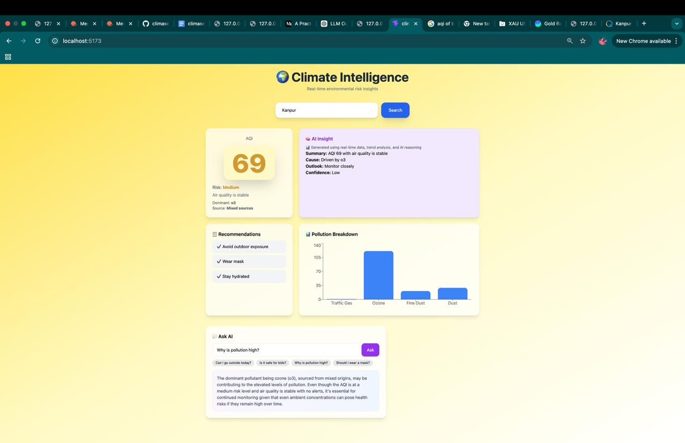
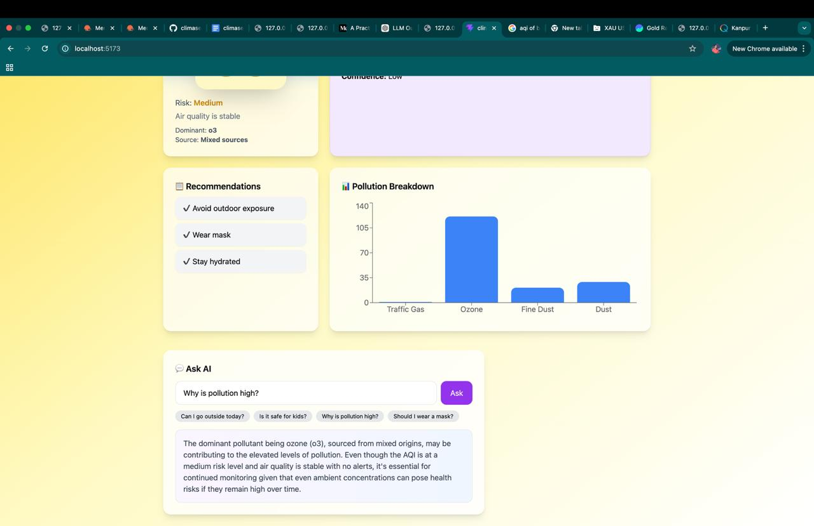
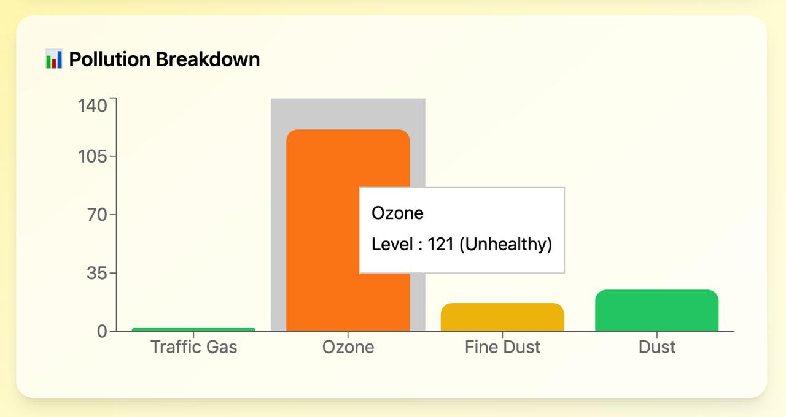
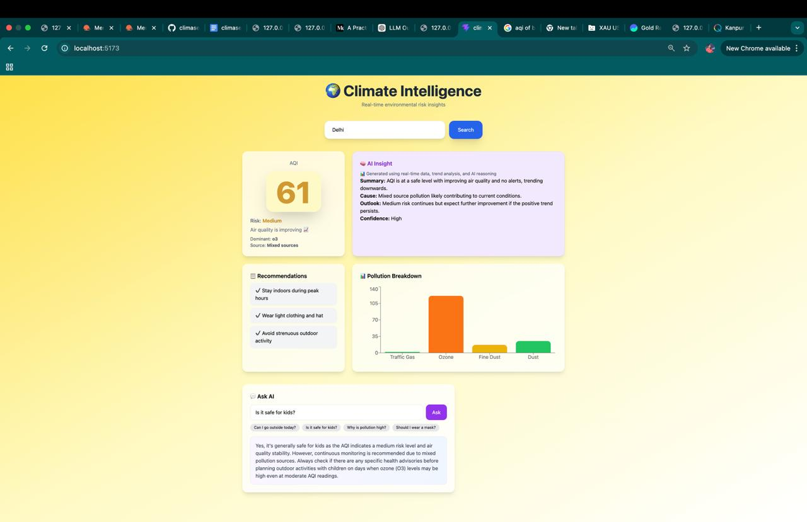
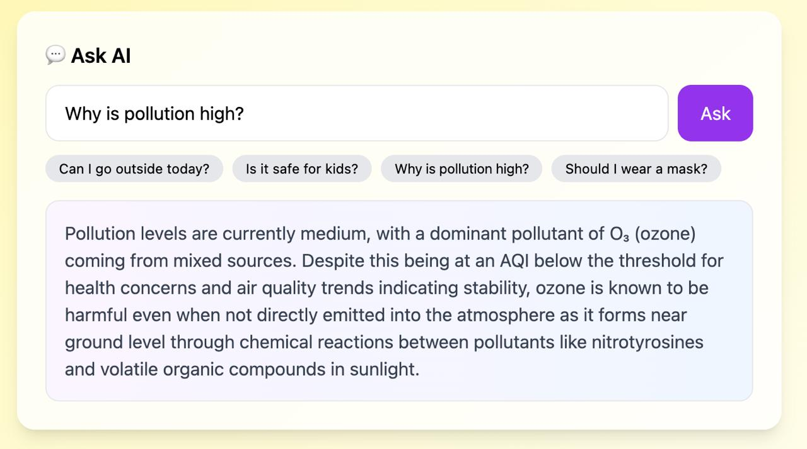
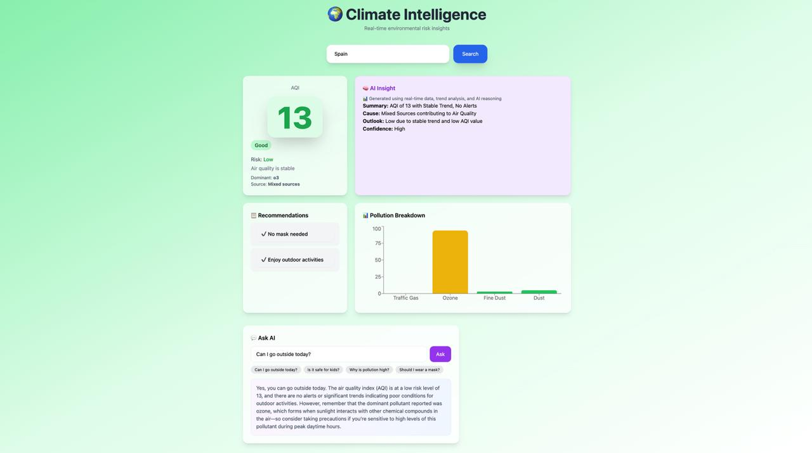

# 🌍 Climate Intelligence (ClimaSense AI)

An AI-powered system that turns real-time air quality data into actionable decisions using multi-agent intelligence.

---

## 🧠 Overview

**Climate Intelligence** transforms raw environmental data into meaningful decisions.

It combines:
- Real-time AQI data
- AI-driven reasoning
- Context-aware recommendations
- Natural language interaction

👉 The system acts like a **decision-making assistant**, not just a dashboard.

---

## ✨ Key Features

### 🌫️ Real-Time AQI Monitoring
- Live AQI data per city
- Risk classification (Low → Severe)
- Dominant pollutant detection

---

### 🧠 AI Insight Engine
- Summary of air conditions
- Root cause analysis
- Future risk outlook
- Confidence scoring

---

### 📋 Agentic Recommendations
- Dynamically generated based on AQI and risk level  
- Adapts to dominant pollutant (e.g., ozone, PM2.5)  
- Produces actionable, real-world guidance (not static rules)

---

### 💬 AI Assistant
- Ask natural questions:
  - "Can I go outside today?"
  - "Is it safe for kids?"
- Responses grounded in real-time data

---

### 📊 Visual Pollution Breakdown
- Component-level pollutant visualization
- Severity-based color indicators

---

## 🖼️ Screenshots

### 🔹 Dashboard Overview (Moderate AQI)


---

### 🔹 Recommendations & Pollution Breakdown


---

### 🔹 Pollution Level Visualization (Tooltip)


---

### 🔹 AQI Variation Across Cities


---

### 🔹 AI Chat Assistant


---

### 🔹 Good AQI Scenario (Safe Conditions)


---

## 🏗️ Architecture

- Designed with modular agent architecture for scalability

```

Frontend (React + Vite)  
↓  
Backend (FastAPI APIs)  
↓  
Multi-Agent Intelligence Layer  
↓  
LLM (Ollama - Local)

```


---

## 🤖 AI Agent System

This project follows a **modular multi-agent design**:

| Agent | Responsibility |
|------|--------------|
| Data Agent | Fetches AQI data |
| Risk Agent | Computes environmental risk |
| Memory Agent | Tracks historical trends |
| Alert Agent | Detects anomalies |
| Health Agent | Maps AQI → health impact |
| AI Agent | Generates insights, recommendations, answers |

---

## 🧪 Tech Stack

### Frontend
- React (Vite)
- Tailwind CSS
- Recharts

### Backend
- FastAPI
- Python

### AI Layer
- Ollama (phi3 / local LLM)
- Prompt-engineered reasoning

---

## ⚙️ Installation

### 1. Clone Repository
```bash
git clone https://github.com/Shagun0777/climasense-ai
cd climasense-ai
```

### 2. Backend Setup
```bash
cd backend
pip install -r requirements.txt
uvicorn main:app --reload
```

### 3. Frontend Setup
```bash
cd frontend
npm install
npm run dev
```

## ⚠️ Note on AI Model

This project uses Ollama (local LLM).

- Requires local setup
- Not deployed in cloud version
- Can be replaced with OpenAI / Groq APIs

## 🚀 Future Improvements

- Hosted LLM integration (Groq / OpenAI)
- Personalized health recommendations
- Weather + pollution correlation
- Mobile optimization
- Real-time alerts

## 🎯 Why This Project Matters

This project demonstrates:

- ✅ Building real-world AI systems (not just models)  
- ✅ Designing modular multi-agent architectures  
- ✅ Integrating LLMs with structured outputs  
- ✅ Translating raw data into actionable decisions  
- ✅ Full-stack product thinking with clean UI/UX  

## 👨‍💻 Author

Shagun Tripathi

## 📌 Repository

👉 https://github.com/Shagun0777/climasense-ai

> This project focuses on making AI useful, not just impressive.


